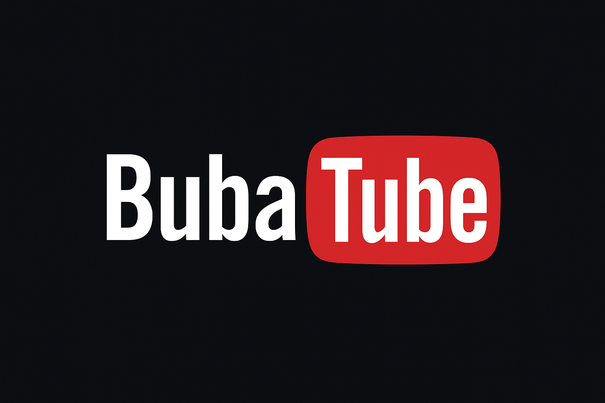
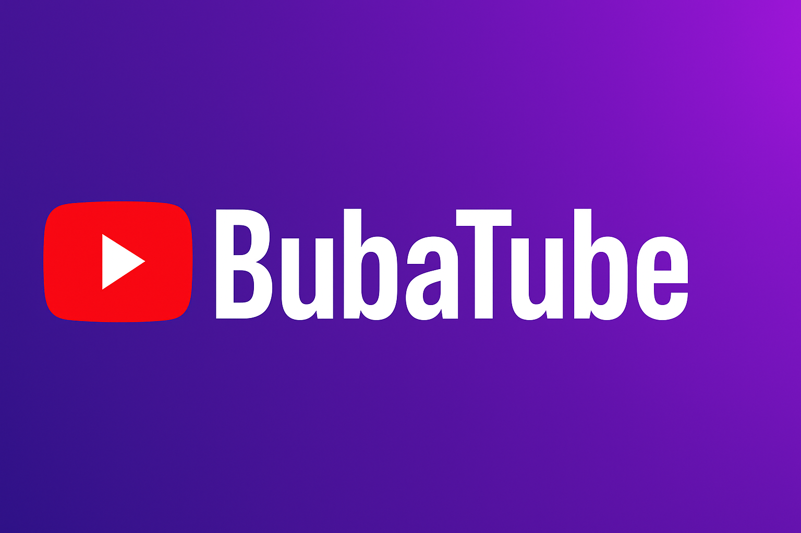

  

  

## 👤 Autor
Pedro

## 🚀 Proyecto
BubaTube es un clon de YouTube creado con **HTML, CSS y Firebase**.  
Incluye login con **Google, GitHub y correo electrónico**.

## 🌍 Demo
👉 (https://gianthug.github.io/Login-bubatube/)

## 📂 Estructura
- `index.html` → Página de inicio de sesión  
- `register.html` → Registro de usuarios  
- `grand.html` → Página principal con videos  
- `style.css` → Estilos generales  
- `grand.css` → Estilos de la página principal  
- `register.js` → Lógica de registro  
- `index.js` → Lógica de login  
